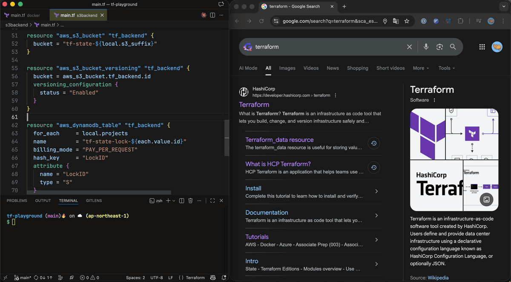

# tfdoc

A VS Code extension to open Terraform Provider documentation in your browser.



## Features

- Open the documentation of the Terraform resource or data source at the cursor position.

## Usage

By default this extension does not have a keyboard shortcut. To bind it to a key you like, add an entry to your `keybindings.json`. In this example the command is bound to the `cmd+; cmd+t`:

```json
[
  {
    "key": "cmd+; cmd+t",
    "command": "tfdoc.openDocs",
    "when": "editorTextFocus && editorLangId == 'terraform'"
  }
]
```

## Requirements

- Visual Studio Code 1.106.1 or later.

## Install

```shell
code --install-extension mi-wada.tfdoc
```

## ToDo

- [ ] Write tests.
- [ ] Setup CI/CD.
- [ ] Detect provider version from `required_providers` block in Terraform configuration.

## Known Issues

- When a resource or data source has multiple parameters with the same name, the extension cannot navigate to the correct parameter's documentation. Currently, it will navigate to the first occurrence of that parameter.
  - Example: <https://registry.terraform.io/providers/hashicorp/aws/latest/docs/data-sources/instance#device_name-2>
