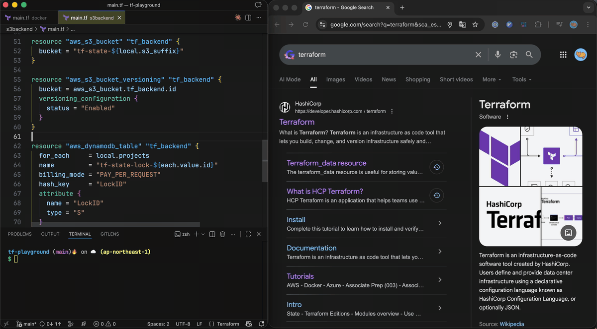

# tfdoc

A VS Code extension to open Terraform Provider documentation in your browser.



## Features

- Open the documentation of the Terraform resource or data source at the cursor position.

## Usage

1. Place your cursor on a Terraform resource or data source
2. Open the command palette (`Cmd+Shift+P` on Mac, `Ctrl+Shift+P` on Windows/Linux)
3. Run the command "tfdoc: Open Terraform Provider Docs"

Alternatively, you can use the default keyboard shortcut `Ctrl+; Ctrl+T` (Mac: `Cmd+; Cmd+T`).

### Customizing Keyboard Shortcut

If you prefer a different shortcut, you can customize it in your `keybindings.json`:

```json
[
  {
    "key": "cmd+k cmd+d",
    "command": "tfdoc.openDocs",
    "when": "editorTextFocus && (editorLangId == terraform || editorLangId == hcl)"
  }
]
```

## Requirements

- Visual Studio Code 1.106.1 or later.

## Install

```shell
code --install-extension mi-wada.tfdoc
```

## Release

### Manual release (current)

Releases are published manually from a local checkout.

1. Make sure you are logged in to the VS Code Marketplace:

   ```
   npx @vscode/vsce login mi-wada
   ```

2. Bump the version and publish. `patch`, `minor`, or `major` updates `package.json`, creates a git commit and tag, and uploads to the Marketplace:

   ```
   npx @vscode/vsce publish patch
   ```

   Or specify an explicit version:

   ```
   npx @vscode/vsce publish 0.1.0
   ```

3. Push the version commit and tag:

   ```
   git push origin main --tags
   ```

Note: Azure DevOps global PATs are retired on December 1, 2026, so PAT-based publishing must be migrated before then.

### Future: automated release with OIDC trusted publishing

`vsce publish --oidc` lets GitHub Actions publish without a PAT. As of August 2026 the VS Code Marketplace does not yet expose a trusted publishing configuration (the vsce-side support shipped first), so this cannot be used yet. Once the Marketplace supports it:

1. Configure the trusted publishing policy on the Marketplace for the repository (`mi-wada/vscode-tfdoc`) and the release workflow.
2. Re-add a `release.yml` workflow triggered on `v*` tag pushes that requests an OIDC token and publishes:

   ```yaml
   jobs:
     publish:
       runs-on: ubuntu-latest
       permissions:
         contents: write
         id-token: write
       steps:
         - uses: actions/checkout@v4
         - uses: actions/setup-node@v4
           with:
             node-version: 22
         - run: npm ci
         - run: npx @vscode/vsce publish --oidc --no-git-tag-version --no-update-package-json
   ```

## Known Issues

- When a resource or data source has multiple parameters with the same name, the extension cannot navigate to the correct parameter's documentation. Currently, it will navigate to the first occurrence of that parameter.
  - Example: <https://registry.terraform.io/providers/hashicorp/aws/latest/docs/data-sources/instance#device_name-2>
